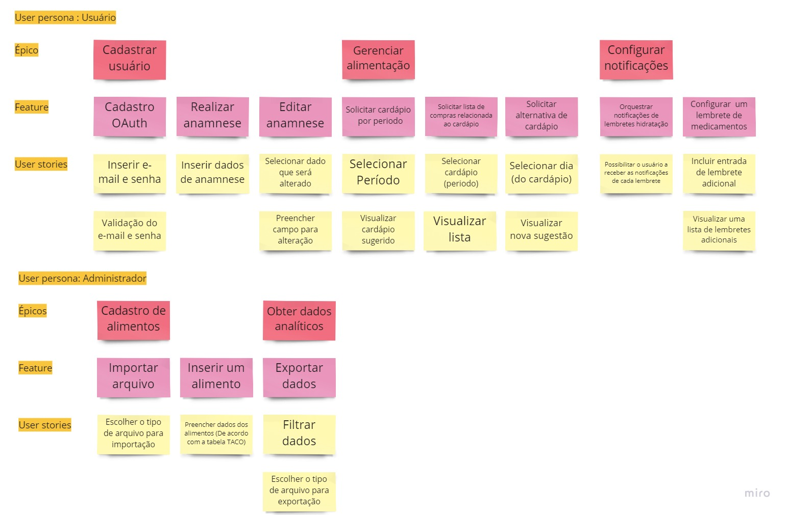

## Épicos, features e histórias de usuário

## Cartão: Solicitar cardapio por período
### Conversas
O usuário deve selecionar um período para que o cardápio seja gerado, para isso a anamnese do usuário deve ter sido realizada para que as refeições sejam geradas com base nos dados personalizados do usuário. 
### Testes
- Checar validação de datas
Validação Ananmese;
- Se estiver ok:
    * Calculo para obtenção do cardápido (Com base no gasto calórico ou IMC);
    * Validação se as sugestões tem alimentos que o usuário é alergico;
- Se não:
    * Pedir para completar os dados da anamenese.

## Cartão: Solicitar lista de compras
### Conversas
O usuário deve selecionar um cardápio gerado por período para que os produtos e quantidades de compra sejam calculados e registrados na lista de compras para ser apresentada.
### Testes
- Checar quantidade de alimentos relativa ao cardápio selecionado

## Cartão: Solicitar alternativa de cardápio
### Conversas
O usuário deve selecionar um dia do período do cardápio gerado para que o sistema gere uma alternativa com outros alimentos para esse dia.
### Testes
- Validação se as sugestões tem alimentos que o usuário é alergico;
- Verificar calculo com base no gasto calórico ou IMC.
