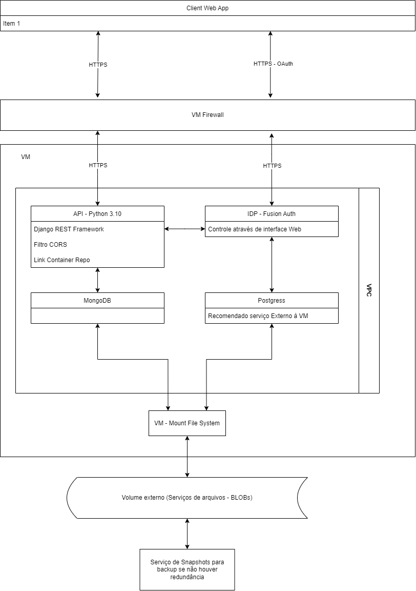
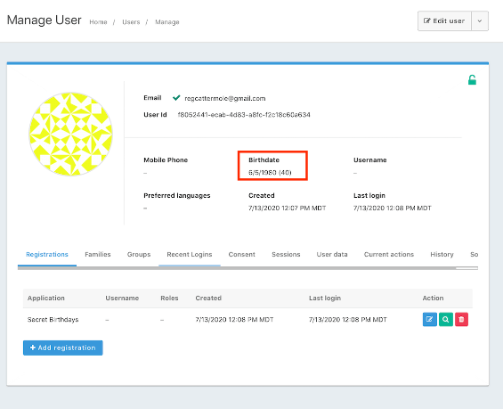

# Arquitetura Backend

[Link para arquivo no Gdrive](https://drive.google.com/file/d/1CA24XPILXxBYLtid1PCO1mjSimEtloso/view?usp=sharing)

## VM

- Rodando Kubernets
- Rotinas bem conhecidas
- Liberdade de firewall, arquivos e programas
- Acesso controlado
  - Não sendo necessário acesso de muitas pessoas

### Kubernets

- Controle de versionamento e ambiente de testes muito bom
- Resiliência no processo, self-healing e orquestramento dos containers
  - Podendo fornecer logs, respostas e ações confiáveis num nível acima de sua aplicação.
- A opção de containers é altamente escalável
- O container da API pode ser armazenado na Azure, podendo ser usado internamente com o Kubernets num fluxo de CI/CD.

### Containers - Dentro do Kubernets

#### FusionAuth - Opção se não houver IDP externa

- A IDP da Fusion-Auth, pode ser self-hosted e pode cuidar de toda a autenticação com tecnologia OAuth2.0
  - Comunicação interna por segurança (Firewall rules)
- Pode cuidar de todo o fluxo de cadastramento e acessos das aplicações através da interface Web
- Possui uma API para comunicação com a aplicação
- Informações básicas que gerencia
  - Data de nascimento
  - Email
  - Nome de Usuário (Pode ser exclusivo)
  - Telefone
  - Linguagem de preferência

- Dificuldades:
  - Configuração de endpoints
  - Segurança de certificados
  - Responsabilidade
  - Necessita de um serviço de database Postgress
    - Recomendado ser uma database externa, se não, pode ser orquestrada junto à VM.
    - Tomando cuidado para manter o registro de forma persistente caso a VM caia, uso de um volume externo a VM.

- Vantagens:
  - Serviço grátis - self-hosted
  - Mais segurança em ser separada da aplicação
    - Database separada (Postgress)
    - Segregação e controle de dados e acessos
  - Automação de quase todos processos que envolvem a autenticação
    - Fluxo de recuperação de senha e confirmação de email automatizado
    - Filtro de CORS e limites de erros personalizável
  - Integrações com serviços externos
    - Outros provedores como o Google
    - Aplicativos 2FA

  
  
[Integração Django + FusionAuth](https://fusionauth.io/blog/2020/07/14/django-and-oauth)

### MongoDB - v6

- Autenticação segura com a API Backend
- Acesso através de um nó
  - Trabalha muito bem em containers.
- Divisão de processamento de dados com a API, em conjunto com as aggregations
- Pode ser desacoplada para hospedagem em mais VM/Serviços
- Se estiver na mesma VM, tomar cuidado para manter o registro de forma persistente caso a VM caia, uso de um volume externo a VM.
- Já possui um serviço de redundância/orquestramento e de balanceamento de carga, se necessário.
- Facilidade com controle de dados, sendo possíveis criar databases em locais fisicamente diferentes, só precisando de validação de schema.
  - Deixando os dados livres, sendo validados mas sem precisar passar pelo processamento dos mesmos (Mais útil quando trabalha com imagens)

### Python 3.10 - Django REST Framework

- Não é tão performático quanto NodeJS, mas é mais simples de começar e amadurecer uma aplicação.
- Os processamentos de dados podem ser otimizados tanto no nível de database como na API
- Podem haver replicações da database e divisão da carga entre os programas (Podendo aumentar/aproveitar o poder das maquinas em redundância)
- Se a API chegar a ficar muito grande:
  - A migração para uma arquitetura de micro-serviços é facilitada pelo uso da database em MongoDB separada da aplicação.
- Tipagem forte
- Documentação fácil e no código
- Muita integração com MongoDB
  - Possui serialização - A database é alinhada pela tipagem dos dados que são usados na API
- Simples implementação e Containers leves
  - Pode ser replicada em outras VMs, se necessário
  - Pode ser configurado um balanceamento de carga
- Código escalável horizontalmente e verticalmente
  - Várias ferramentas de manipulação de dados
  - Bibliotecas e integrações muito boas
  - Ambientes de testes avançados
- Virtualmente seguro
  - Compatível com OAuth1 e OAuth2 - FusionAuth
  - Compatível com SSL e TLS
  - Conexões com database e serviço OAuth feita em VPC interna, até mesmo interna no Kubernets.
- Pode fornecer o front-end para aplicações em navegadores
  - Com hospedagem na Azure e/ou em outros serviços
  - Pode ser facilmente consumido por aplicações em React-Native
